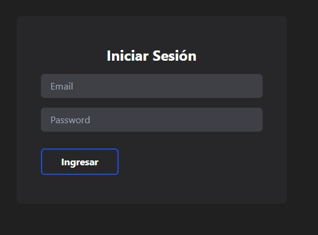
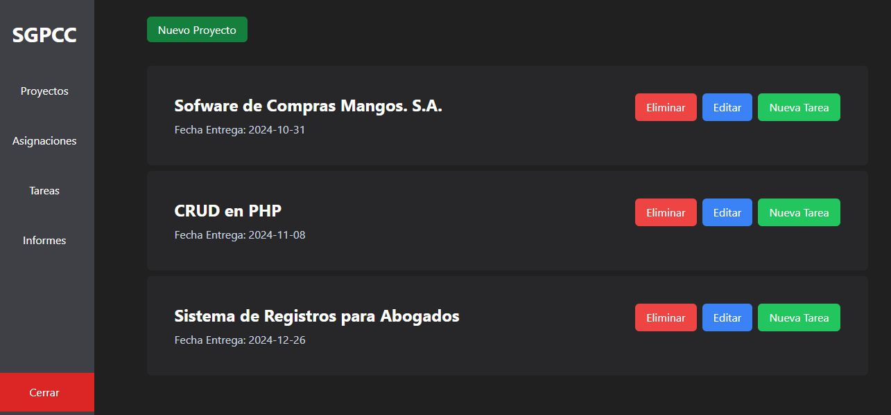
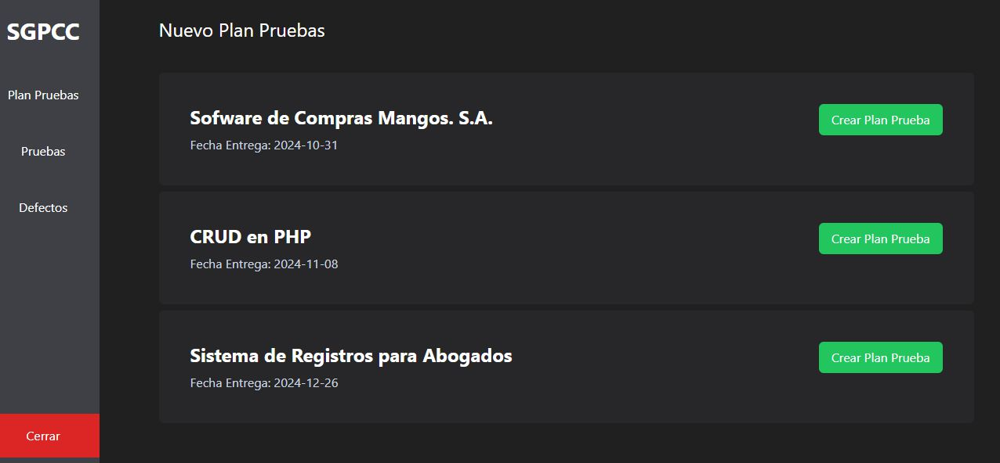
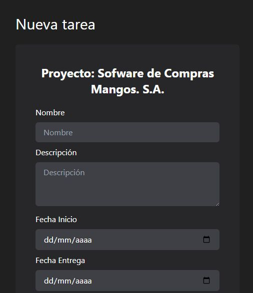
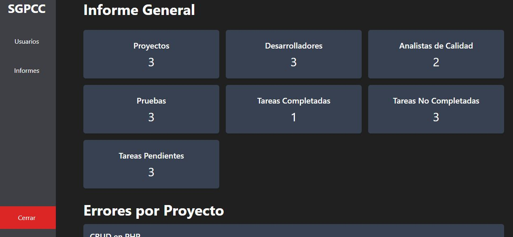

# SISTEMA DE GESTION DE PRUEBAS Y CONTROL DE CALIDAD

Sistema de gestión para proyectos de desarrollo de software.

## Tecnologias Utillizadas

- React
- Node.js
- PostgreSQL
- Render Server
- Tailwind

## Capturas de Pantalla

### Login 

### Proyectos

### Planes de Pruebas

### Formularios

### Informes

